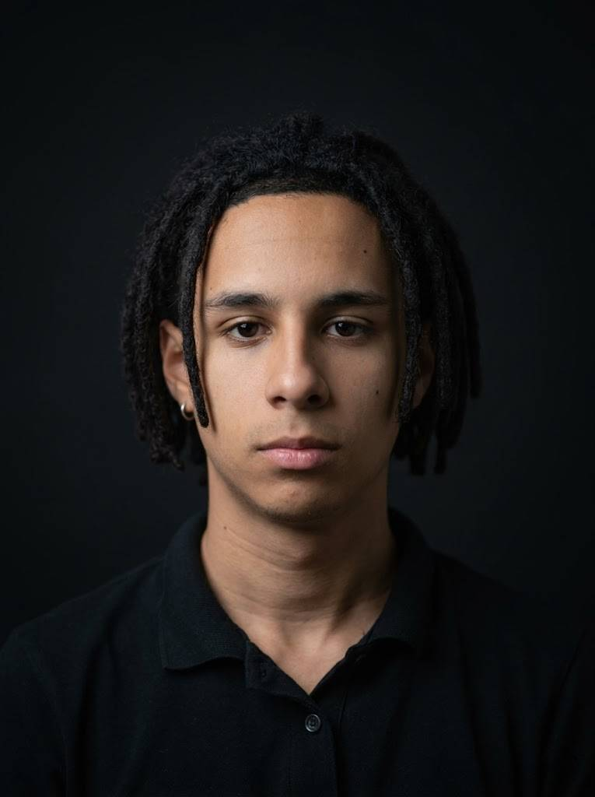

# 💻 Pietro Abreu | PortfolioHUB

  
  
🚀 Estudante de Engenharia da Computação apaixonado por tecnologia, automação, hardware e design.

  <a href="https://gelolsemtampa.github.io/portfolioHUB/"><strong>✨ Acesse o Portfólio Online ✨</strong></a>

---

## 📖 Sobre Mim

Sou estudante de Engenharia da Computação com experiência prática em tecnologia, robótica, design e automação. 

Atualmente trabalho na escola **SERIÖS** como Técnico de TI, atuando diretamente com infraestrutura, redes de servidores, manutenção de hardware avançada e suporte técnico especializado. Também possuo bagagem como Professor de Robótica, desenvolvendo o pensamento lógico e a criatividade de crianças através da programação e montagem de robôs.

---

## 🛠️ Tecnologias & Ferramentas

  
  
  
  

### 🎯 Áreas de Domínio
- 🖥️ **Hardware & Infraestrutura:** Manutenção preventiva/corretiva e montagem de computadores.
- 🌐 **Redes & Servidores:** Configuração, cabeamento estruturado e suporte a servidores.
- 🤖 **Robótica & Automação:** Desenvolvimento de soluções embarcadas e robótica educacional.
- 🎨 **Design Visual:** Composição visual, identidade de marca e tipografia.

---

## 💼 Experiência Profissional

| Cargo | Empresa / Instituição | Atividades Principais |
| :--- | :--- | :--- |
| **Técnico de TI** | Escola SERIÖS | Suporte técnico geral, redes de servidor, manutenção de hardware, formatações e gerenciamento de infraestrutura de TI. |
| **Professor de Robótica** | Mearas Sports | Ensino de robótica educacional para crianças de 4 a 12 anos, introdução à lógica de programação e montagem mecânica. |

---

## 🏆 Projetos e Conquistas

* **🏆 FLL - Master Piece:** Responsável direto pela construção mecânica e programação de software do robô vencedor do *Troféu de Design de Robô*.
* **🧘 Sistema de Postura Inteligente:** Projeto de IoT/Hardware utilizando sensores dedicados para monitoramento e correção de postura corporal em tempo real.
* **🍓 Projetos com Raspberry Pi:** Desenvolvimento de automações residenciais/comerciais e criação de dispositivos personalizados.

---

## 🎯 Objetivo do Projeto

Este repositório serve como centralizador da minha trajetória acadêmica e profissional, focado nas boas práticas de:
- Versionamento e organização com Git/GitHub
- Deploy automatizado com GitHub Pages
- Desenvolvimento Front-end limpo e responsivo

---

## 📬 Contato

Caso queira trocar uma ideia sobre projetos, automação ou oportunidades, sinta-se à vontade para me chamar!

- 📧 **Email:** [pietroforwork@gmail.com](mailto:pietroforwork@gmail.com)
- 💼 **LinkedIn:** [linkedin.com/in/pietroforwork](https://www.linkedin.com/in/pietroforwork)
- 🎨 **Behance:** [behance.net/pietroabreus](https://www.behance.net/pietroabreus)